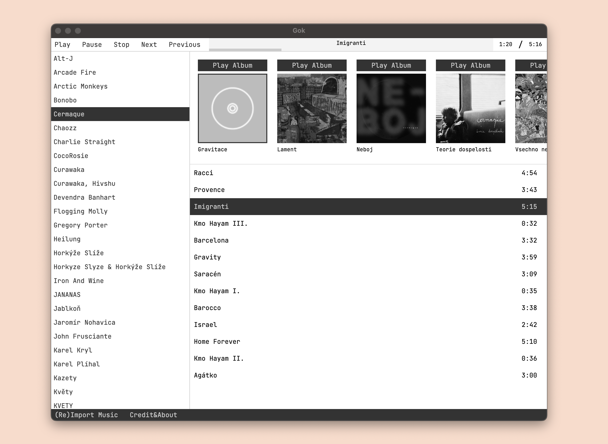

### Gok - Grayscale desktop music player

### Download:
- macOS: [Gok-1.0.0-arm64.dmg]()
- Windows: [Gok Setup 1.0.0.exe]()
- GNU/Linux: [Gok-1.0.0-arm64.AppImage]()

### How to use
Simply choose a folder from which you want to Import the music using the button at the bottom left. Gok will keep the files where they are and just form its own log of it. Gok is un-opinionated so the title, artwork, song numbers and other details are directly read grom song metadata (ID3 Tags).

### Development
Peak into commits or release history for changes made in Gok. If you want a local development setup, simply clone the repo and proceed with `npm install`.

It's developed and built with electron at it's core, so __main.js__ takes care of system resources and app handling, while __renderer.js__ is the file with the actual app logic and probably the one you want to add to/edit.

### Contact
For a general contact, reach out at __adam@rajnoha.com__ or __@hlubac.31__ on Signal. Open issues as you need or PRs. Thanks and happy listening! 